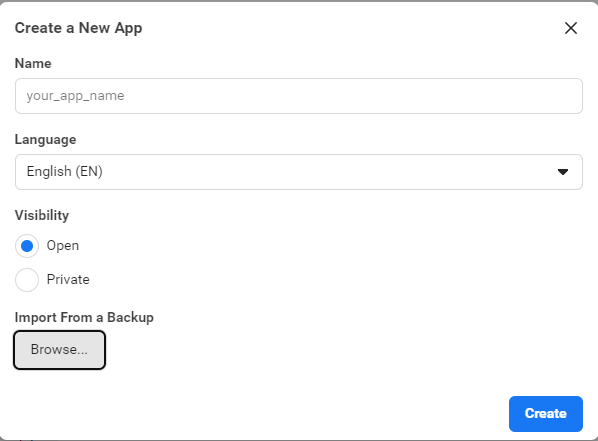
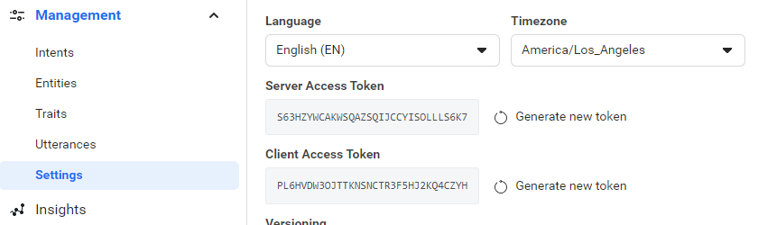

# Voice SDK Unreal Samples

This is a demo game for Voice SDK. It demonstrates how to add Voice Commands and TTS into an Unreal game.  In the game user can use Voice Commands to change objects' color.

## Supported Engine Versions:

UE4.27, UE5.0 and UE5.1.

## Getting Started

:golf: By following below steps you will be able to get the sample app running on your computer, you will be able to use your voice to interact with the game to change objects' color.

1. Create a wit.ai app:

    - Download our app backup file from [here](https://github.com/wit-ai/voicesdk-unreal/releases/download/v47.0.4/wit_app_shapes_demo-2023-01-18-11-12-27.zip).

    - Visit [Wit.ai](https://wit.ai/apps) and create a new app with the backup file.

  

2. [Download](https://github.com/wit-ai/voicesdk-unreal-samples/archive/refs/heads/main.zip) this sample project, and unzip it.

3. Run `install_VoiceSDK.bat` to install Voice SDK.

4. Double click `voicesdk_unreal_demo.uproject` to open the project

5. The first time you run this project, Unreal will need to compile Voice SDK, it will pop a window: `Missing voicesdk_unreal_demo Moduels`, then click `Yes` to compile Voice SDK.

6. Once Unreal editor opened, then open the `ShapeConfiguration` file from `Content/VoiceSDK/Demo/Configuration` and put your Wit.ai's `Server Access Token` and `Client Access Token` there. Tokens can be found here:

  

7. `Play` the game and now you can try our magic: :sparkles: `Make the cube red`

  - You can use the input box to give a text command (e.g. `Make the cube red`) and then click the `Send` button to execute

  - Or click the `Acitvate` button to give a voice command.

**Congratulations you made it! :trophy:**

If you cannot work it out, please check out the below video which shows how people follow the above steps to get the sample app to run:
  

If you still cannot get it to run, please feel free to create an issue, we will help you.

## License

The license for `voicesdk-unreal-samples` can be found in [LICENSE](https://github.com/wit-ai/voicesdk-unreal-samples/blob/main/LICENSE) file in the root directory of this source tree.

You can also find the applicable Oculus License here: https://developer.oculus.com/licenses/oculussdk

The MIT license applies to only certain, clearly marked documents. If an individual file does not indicate which license it is subject to, then the Oculus License applies.

## Terms of Use

Our terms of use can be found at https://opensource.facebook.com/legal/terms.

Use of Wit.ai services fall under the terms of use of Wit.ai found here: https://wit.ai/terms.

## Privacy Policy

Our privacy policy can be found at https://opensource.facebook.com/legal/privacy.

The privacy policy for the Wit.ai service can be found at https://wit.ai/privacy.
